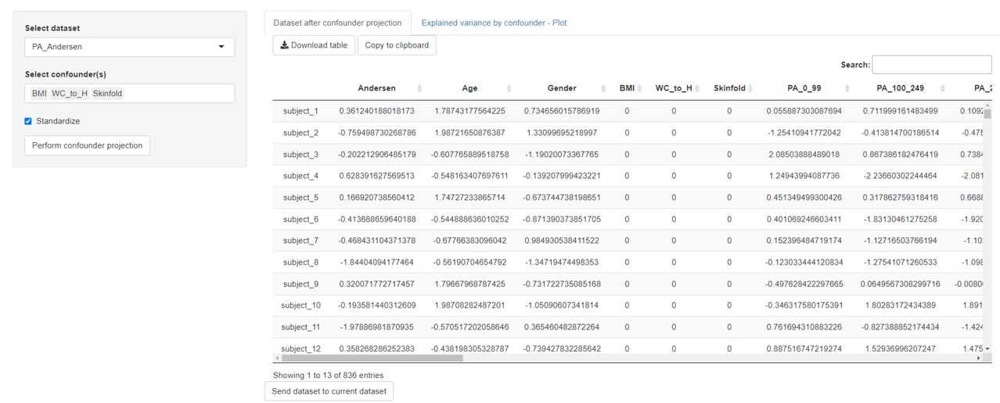
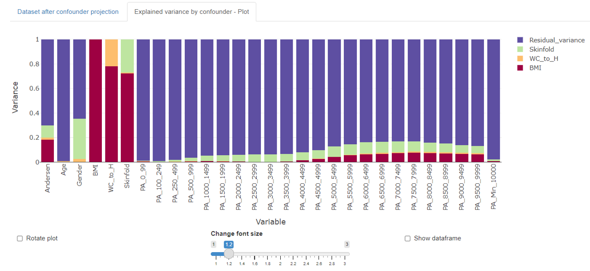

## Covariate projection

Covariates  (or confounders) are variables that are associated with both an explanatory and a response variable. In other words, they interfere with or obscure the relationship between the explanatory and response variable.  An  example is the influence of adiposity (covariate) on the relationship of physical activity (independent variable) and the resulting aerobic fitness (response).

Covariance projection is a method to adjust covariate influence in multivariate datasets by defining a covariance weight vector **wCP** that is multiplied with the centered augmented data matrix **Xaug** that contains **X**, **y** and also the covariates **z** (**Xaug** = [**X**, **y** ,**z**]). The weight vector **wCP** has as many entries as variables exist in **Xaug** and contains zeros in positions of **X** and **y** and ones in **z** position (= covariate entry). This enables the calculation of the covariance projection scores **tCP** and subsequently the loadings **pCPT**. 

1) **tCP** = **Xaug  wCP**  
2) **pCPT** = **tCPT** **Xaug** / (**tCPT** **tCP**)

Using the loadings and scores, the adjusted augmented **Eaug** can be calculated (= **Dataset after covariate projection** in *mvpaShiny* covariate projection tab). 

3) **Eaug** = **Xaug**  –  **tCP** **pCPT**

This matrix can be used to perform follow-up analyses like PLS-regression. Ideally, the influence of the covariates have been removed so that the "real" relationship between explanatory and response variables can be determined.

In order to perform the covariance projection in *mvpaShiny* a dataset needs to be selected (= **Xaug**) and the covariates have to be defined. Standardization is a useful and recommended step to equalize variables importance. The **Perform covariate projection** button will start the calculation.

> NOTE: The **order** of selected covariates matters when the explained variance by covariate plot is viewed. While **Eaug** will be identical, the explained variance by the individual covariate might differ.

### Explained variance by covariate plot

