# Datasets tab

Load and manipulate datasets from external sources or use the in-built demo dataset to learn how to use *mvpaShiny*. 

## Load datasets

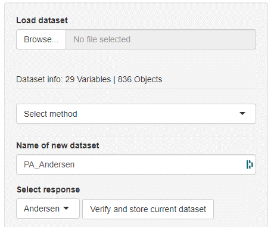

Datasets can be loaded by clicking the **Browse** button. Allowed dataset formats are **.tsv**, **.csv**, and **.xlsx**.  The left outermost column will automatically be interpreted as object names (= row names) and the next column as the response variable (***y***). The first row will be interpreted as the variable names (= column names). In general, *mvpaShiny* interprets rows as objects and columns as variables. 

> **NOTE:** Variable names that start with a number and/or contain special characters will be altered so that R can use these names correctly. Therefore avoid variable names with special characters and leading numbers. (Certain special characters, such as the underscore are unaffected). Example behavior: 123.456-weight → X123.456.weight

***mvpaShiny*** comes with an in-built demo dataset which can be loaded by clicking the **Load demo dataset** button in the lower left part of the screen of the datasets tab.

## Verify datasets for downstream analysis

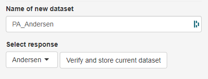

Before being able to use a dataset, the dataset has to be given a name (**Name of the dataset** field) and then needs to be checked for various factors (**Verify and store current dataset** button). Among others, the dataset is tested for missing values, string variables and invariant variables (variable variance = 0). Variables of such types need to be fixed before the dataset can be analyzed. How to fix certain issues will be explained in the method section further down.

## Manipulate current dataset or create subsets

Once a dataset is loaded, a handful of methods and options are available to manipulate the dataset. Typically, subsets can be created based on certain variable value conditions (eg. keep all objects that have a greater weight than 20 kg) or whole objects or variables can be removed. Each individual subset can be stored as its own **available valid dataset** and can be used for downstream analysis. This enables seamless data handling of one dataset without the necessity to create subsets outside of *mvpaShiny*. 

### Remove or keep objects / variables

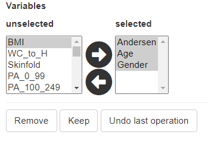

Below the **current dataset** two select fields can be found that enable the selection of and/or objects. By clicking the right arrow, selected items in the **unselected** field can be moved to the **selected** field. Those variables/objects are considered selected. By either clicking the **Remove** or **Keep** button, the respective items will be discarded or kept. **Undo last operation** negates the last performed step. Multiple items can be selected by pressing CTRL at the same time or SHIFT to select items in a range.

> **NOTE:** It is also possible to reset the current dataset by clicking the **Reset dataset** button. This loads the initially unedited dataset.

### Methods to manipulate the current dataset

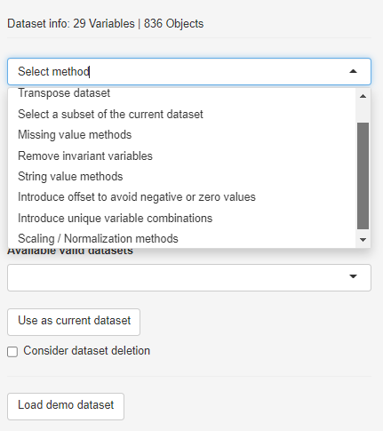

To create variable-dependent subsets, scale/transform the data or remove invariants, the respective method has to be selected from the drop-down menu. 

#### Transpose dataset

The simple **apply** button will transpose the dataset, meaning it switches rows with columns (objects with variables).

#### Select a subset of the current dataset

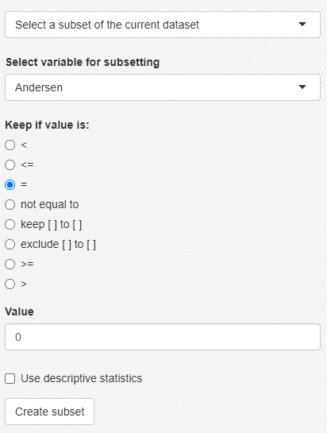

Based on the selected variable and condition, objects are filtered. It is also possible to create subsets based on a descriptive statistics feature like mean or median, instead of manually selecting a value.

#### Missing value methods

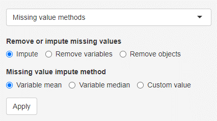

Certain methods, like principal component analysis can not handle missing values. Therefore those values have to be either imputed or the respective variables/objects need to be removed. Missing values can be substituted with the variable mean or variable median or a custom value.

#### Remove invariant variables

In case a variable is invariant, meaning that the variable variance (and therefore also the standard deviation) is zero, the respective variable needs to be removed. This method indicates which variable(s) are affected and allows a simple removal.

#### String value methods

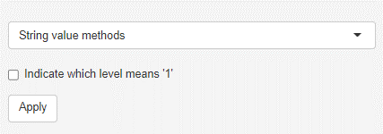

String variables can not be handled by the methods in *mvpaShiny*. They need to either removed or converted into dummy variables. Dummy variables represent the string variables, whereby the presence of the respective string is encoded as 1 and its absence as 0. In case the variable contains only two unique strings (binary categorical variable, eg. married), only one dummy variable will be formed to avoid redundancy. The **Indicate which level means '1'** checkbox allows to alter the variable name, so that the value that represents 1 is added to it (eg. married becomes married_yes). In the case of more than 2 strings, each string becomes its own dummy variable.

#### Introduce offset to avoid zero or negative values

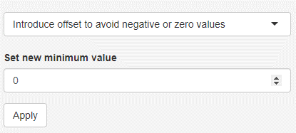

Negative values or zero values hinder the usage of log or square root transformations. It might be therefore important to raise the minimum to a small positive number. It is possible to perform this step for individual variables. To do so, the respective variable needs to be selected as if it was either kept or deleted (HOTLINK to remove keep variables). The selected value becomes the new minimum for that variable. In case no negative or zero value exists, no operation is performed.

#### Introduce unique variable combinations

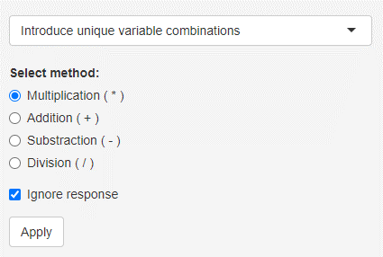

This feature allows to create unique variable combinations (= cross terms). How the combination of two variables is formed depends on the selected method. If the **Ignore response** checkbox is selected, only variable combinations without the response are formed. This method can be computationally heavy and should only be performed for a few variables.

#### Scaling / Normalization methods

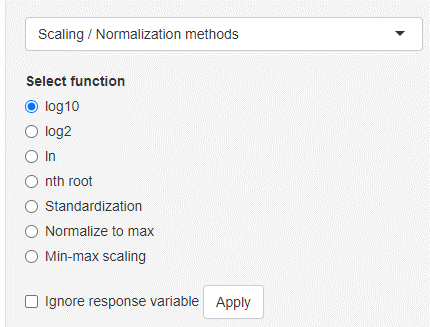

Data scaling/normalization/transformation can be performed on the entire current dataset or also specific variables. In order to select specific variables, use the variable selection chooser underneath the current dataset. Variables that are on the right side are considered **selected**. Selecting the **nth root** option will show a new input where the **n** can be chosen (n = 2 → being the square root operation). **Standardization** will divide each variable by the variables standard deviation (sample standard deviation with n - 1). This will result in an error when the selected variable is invariant (standard deviation equals 0).

> Be aware that certain methods like log or nth root transformation only work on positive or non-zero values!

### Valid dataset tab

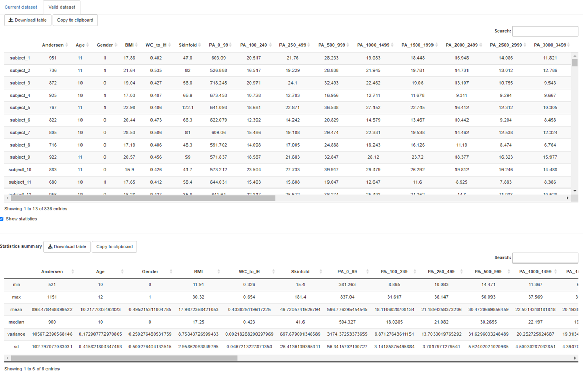

The valid dataset tab allows users to have a look at the selected **available valid dataset** and also show simple descriptive statistics like mean, median, standard deviation and so on. Selecting another **available valid dataset** will update this tab. 

### Selecting available valid datasets

It is possible to make any formerly verified datasets **current** by clicking the **Use as current dataset** button. Verified datasets might be deleted by checking the **Consider dataset deletion** box and then confirming the deletion.

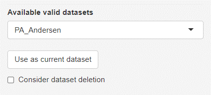

> The latest saved (verified) dataset will be automatically selected as the default dataset in all other analysis tabs.
