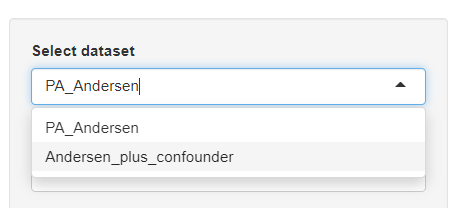
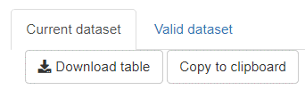
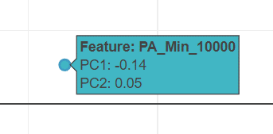
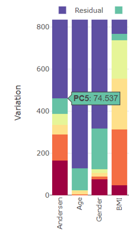
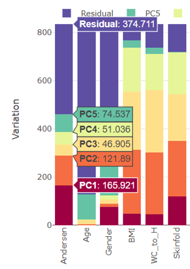

## General concepts

### Dataset selection

Each analysis tab (inspection, principal component analysis etc.) allows the user to freely switch between **available verified datasets**. 

### Download / copy datasets

The majority of visible graphics-underlying tables can be downloaded and also directly copied to the clipboard for easy transfer to external software like Microsoft Excel. Most graphics have a **Show dataframe** button that toggles the underlying table of the shown graphic.

### Handling and saving figures

All graphics in *mvpaShiny* are generated by *plotly* an open-source graphics package ([link](https://plotly.com/r/)).

#### The graphics funtionalities

Each graphic has mouse-over menu that appears when the mouse cursor is hovered over the graphic (top right corner). Description of the individual symbols:

- The **camera** symbol allows to save the shown graphic as .png
- The **magnifying glass** symbol allows zooming
- The **pan** symbol allows to move the shown graphic within the boundaries
- The **autoscale** symbol scales the shown graphic and fits its content appropiately
- The **reset axes** symbol (little house) resets the graphic to its original state
- The **show closest data on hover** symbol (single arrow) highlights the selected datapoint or bar 
- The **compare data on hover** symbol (two arrows) highlights all values within one stacked bar plot

In addition, all graphics come with a **change font size** slider bar and an option to change the size of points in point plots. 

##### Examples

Simple mouse over

**Show closest data on hover** 

**Compare data on hover**

