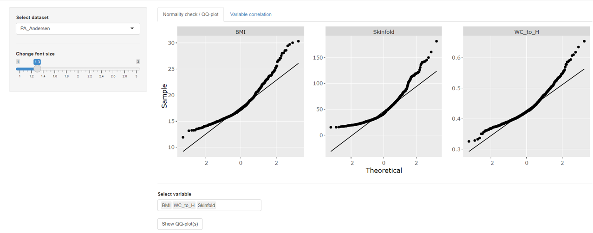
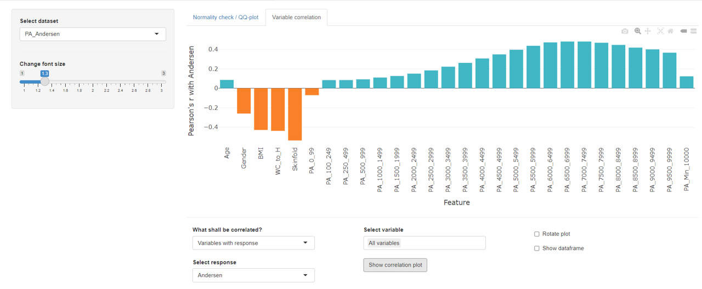
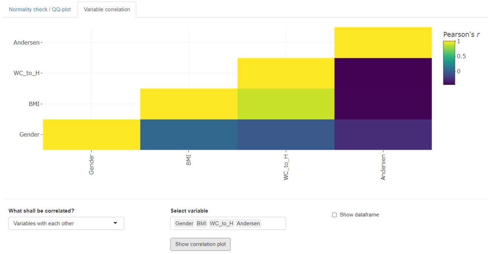

## Inspection tab

The inspection tab offers users the options to create quantile-quantile-plots and visualize variable correlation pattern.

### Quantile-Quantile plots

The purpose of quantile-quantile plots (QQ-plots) is to check whether a variable shows a normal distribution. If a variable is perfectly normally distributed each data point will follow the faint black diagonal which represents a theoretical normal distribution for the given data.

*mvpaShiny* allows to show several QQ-plots side-by-side, using the multiple selection field.

### Correlation plots

*mvpaShiny* can plot two types of correlation:

- Variables with (a single) response. 
  The plot can be rotated by 90° for easier interpretation.
- Variables with each other

