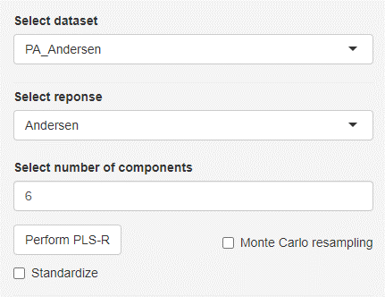
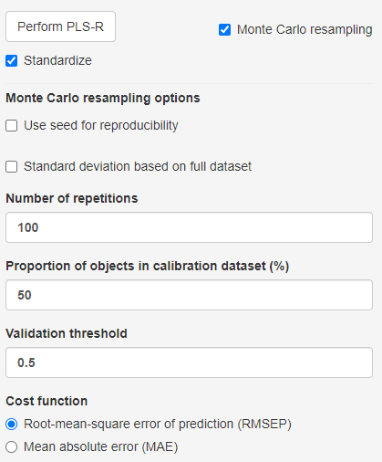
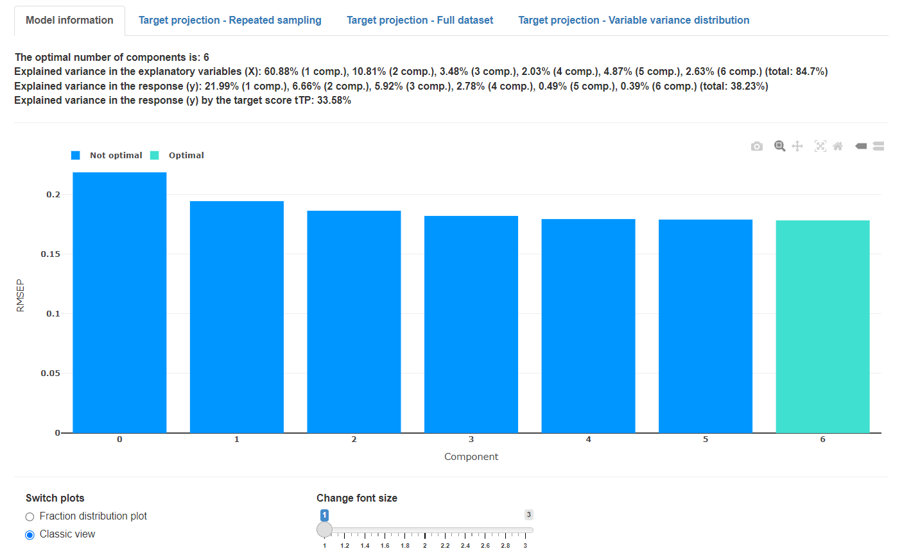
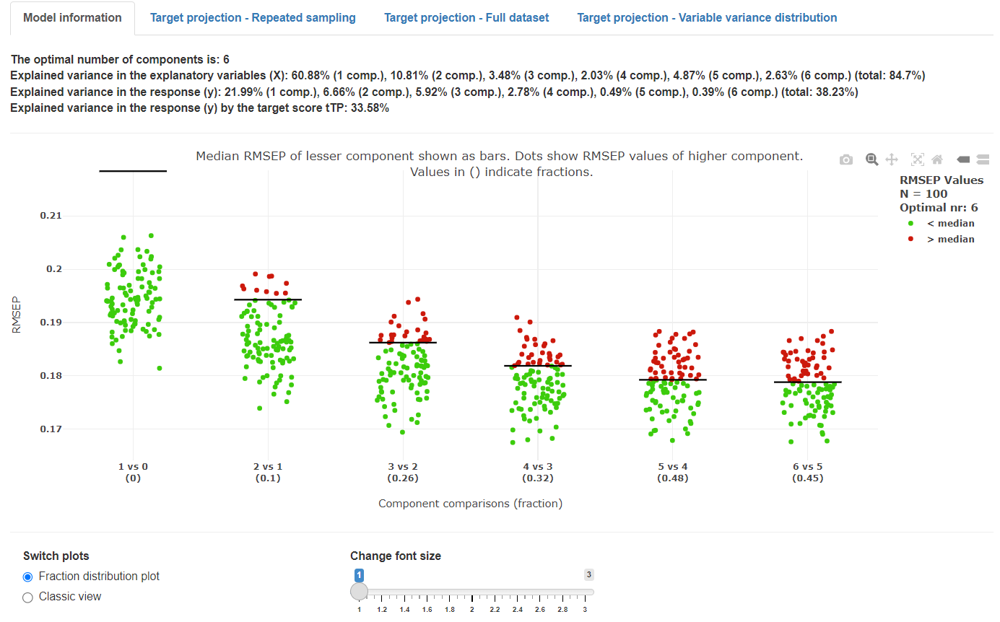
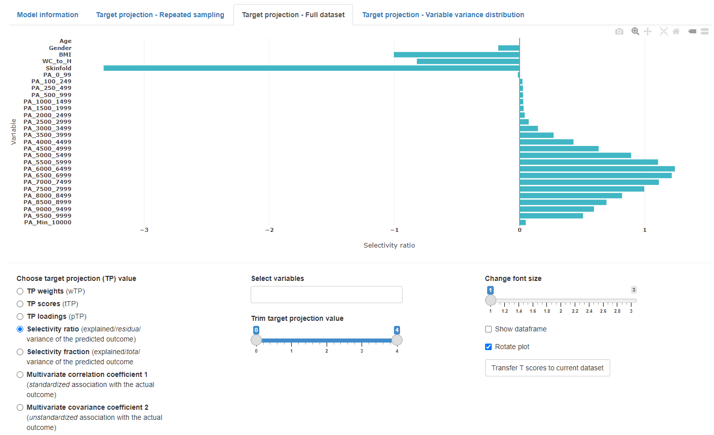
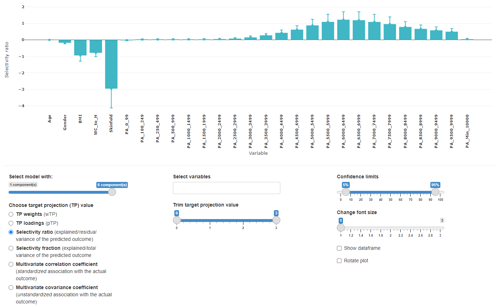
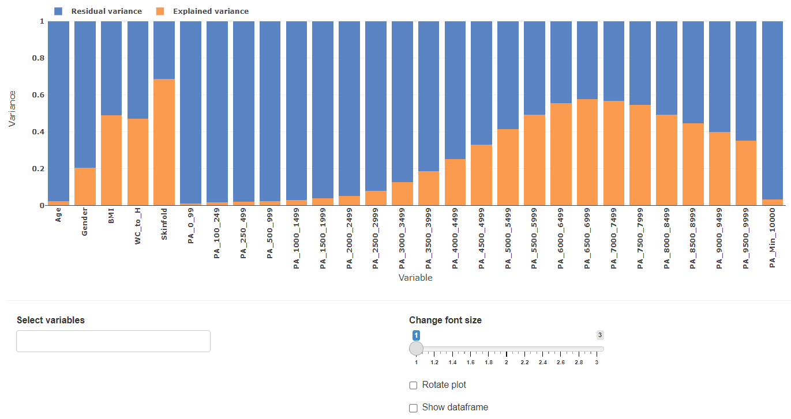

## PLS Regression and target projection

Partial least square or projection to latent structures, in short PLS, is a technique to find the maximum covariance between a explanatory variable matrix **X** and a response vector **y**. In brief, orthogonal latent variables are extracted from the **X** and **y** matrix (similar to PCA) that explain the linear relationship between the independent variables and the response the best. The built model can be used to identify important variables that can be associated with the observed response (eg. how physical activity associates with aerobic fitness,  bioactive constituent in a chemical mixture, and so on). *mvpaShiny* utilizes a method called target projection which uses the PLS model and concentrates the predictive information in the model to a single latent variable maximally covarying with the response. This information is then used to calculate selectivity ratios for each variable that can easily interpreted as indicators for how much a variable contributes to explaining the response. In other words, the higher the absolute selectivity ratio, the more likely it is that the respective variable correlates with the response. 

To perform PLS regression without Monte Carlo resampling (explained in the next section), simply a dataset and the response variable have to be selected and the number of retained components needs to be chosen. The number of components cannot be greater than the number of variables present in the dataset. *mvpaShiny* will automatically adjust the number of components to the highest possible number in such a scenario. Standardization is an optional feature where each variable is divided by the standard deviation of the datasets respective variable.

### Parameter selection Monte Carlo resampling

In most scenarios, the optimal number of components to retain is not known and has to be determined so that model over- and underfitting is avoided. Fortunately, the process of identifying the optimal number of components can be automated through repeated model creation and subsequent performance evaluation. *mvpaShiny* uses the Monte Carlo resampling method. The following steps are repeated N times, where N is chosen, using the **number of repetitions** field.

> NOTE: Resampling is based on random subset selection. In order to reproduce previous results, a **seed** value can be selected that determines the random selection process.

Based on the selected **proportion of objects in the calibration dataset** value, this proportion of the data is used for calibration and the remaining part is used for validation. The calibration data is used to build all PLS models from 0 to **the selected number of components**. The validation set is used to test the performance of each PLS model, using the **cost function** (eg. root-mean-square error or mean-absolute error) as the indicator.

Since the process is repeated N times, the distribution of **cost function** values can be used as a selection criterion for how many components to retain. As overfitting a model is usually less desired than underfitting, the algorithm tests if a higher number of retained components is performing significantly better. The starting point is the number of components that has the overall lowest median **cost function** value. The **validation threshold** is the test criterion. It can be understood as the proportion of N instances a model with more components retained performed better than a model with fewer components.  See the Cost function plot section to see examples.

> NOTE: Due to the nature of random resampling, subsets might contain variables that end up being invariant → variance = 0. This will result in a failure of the method if **standardization** is desired. If that happens *mvpaShiny* suggests to use the **Standard deviation based on the full dataset** option, so that the variance of the full dataset and not only the subset is used. It is not recommended to use this option without having tested it without.

### Cost function plot

> NOTE: Cost function plots are only shown, when Monte Carlo resampling is enabled. 

#### Classic view

The classic **cost function** view shows the **cost function** value on the y-axis and each individual model on the x-axis. The model considered to be optimal is highlighted. The shown error bars are confidence limits, calculated from the N repetitions. 

#### Cost function value distribution plot

The cost function value distribution plot was developed for *mvpaShiny* to give a deeper insight into the optimal model selection. The x-axis shows comparisons of performance of models having different (increasing) numbers of components, where a model with a higher number of components is compared with a model with a lower number of components (for example 3 versus 2). Each dot shows the prediction error (root mean squared error of prediction = RMSEP) of one model out of the total **number of repetitions** set. The horizontal black lines show the median prediction error for a model with a lower number of components (i.e., n – 1). If a model with a higher number of components (e.g., 3 components) performs better than the model with fewer components (e.g., 2 components), a higher fraction of values are below the horizontal bar. If a model with a higher number of components performs worse than a model with fewer components, a higher fraction of values are above the horizontal bar. Orange dots show the number of better models, whereas blue dots show the number of worse models. The proportion of blue to red dots results in the fraction value, shown in the parentheses. If the value is lower than the selected **validation threshold,** the model with the higher number of components is accepted (i.e., this model have a lower median prediction error than a model with fewer components). However, as stated in the Monte Carlo parameter section above, the starting point (eg 3 vs 4 components) for these comparisons is the overall lowest median **cost function** (default RMSEP) value. 

### Algebra behind Target projection

Target projection is a technique to dissect a latent variable regression model (eg from PLS) into its predictive and orthogonal part. This ultimately allows to form descriptors, named selectivity ratios that indicate variables that correlate well with the response. 

Target projection uses the centered **X** matrix and the regression coefficient vector **b** from the latent variable regression model.

The first step involves obtaining the weight vector **wTP** through normalization of the regression coefficients **b**.

1) **wTP** = **b** / ∥**b**∥

From the vector **wTP** and the centered **X** matrix the target projection scores **tTP** can be calculated.

2) **tTP** = **X** **wTP**

Using the TP scores and the transposed **X** matrix the target projection loadings can be obtained. The superscript T indicates the operation of transposing a matrix or a vector.

3) **pTP** = **XT** **tTP** / (**tTPT** **tTP**)

Taken together, **tTP** and **pTP** depict the predictive part of the latent variable regression model.

4) **X** = **tTP** **pTPT** + **ETP**

**ETP** is the residual matrix and will be used to ultimately calculate the residual variance portion of the selectivity ratios (SRs) for all *n* variables.

5) **SR*i*** = varianceexplained, *i* /  varianceresidual, *i* =  ∥**tTP** **pTP, *i*T**∥2 / ∥**ETP, *i***∥2 , *i* = 1, 2, 3, ..., *n*

Multiplied with the sign of the target projection loadings **pTP**, the selectivity ratios can easily be interpreted as features that either correlate positively or negatively with the response.

6) sign = **pTP** / \|**pTP**\|

7) **SR** = sign **SR**

> **Resource:** 
>
> Variable importance: Comparison of selectivity ratio and significance multivariate correlation for interpretation of latent-variable regression models
>
> Olav M. Kvalheim, *Journal of Chemometrics*, 2020, *34*, e3211. [[link to manuscript]](https://analyticalsciencejournals.onlinelibrary.wiley.com/doi/10.1002/cem.3211)

#### Derived selectivity ratios

In *mvpaShiny* not only the selectivity ratios are reported, but also derived metrics that can be interpreted slightly differently. 

Selectivity fraction (**SF**) is calculated by dividing the explained variance by the total variance, instead of the variable's respective residual variance **ETP, *i***.

- **SF*i*** = sign varianceexplained, *i* /  variancetotal , *i* = 1, 2, 3, ..., n )

The multivariate correlation coefficient, or short MCorrC, is calculated by using SF and the explained variance in y (R2Y). Thus, in contrast to SR and SF, this coefficient related to the actual outcome, not the predicted outcome. MCorrC is equivalent to a bivariate correlation coefficient but is derived from the multivariate space. It is favorable for comparing association patterns between groups since coefficients can be compared directly towards the actual outcome.

- **MCorrC** = sign \|**SF** R2Y\|1/2 

The multivariate covariance coefficient (MCovC) is derived from the MCorrC by dividing MCorrC with the standard deviation (SD) of the **X**. Note that associations using MCovC will be fully dependent on how variables from an intensity spectrum is created or binned. Thus, this coefficient should be used carefully and interpreted appropriately.

- **MCovC** = **MCorrC** / SD**X**

  

> **Resource:** 
>
> Interpretation of multivariate association patterns between multicollinear physical activity accelerometry data and cardiometabolic health in children—A tutorial
>
> Eivind Aadland, Lars B. Andersen, Geir K. Resaland, Olav M. Kvalheim, *Metabolites*, 2019,  *9*, 129.  [[link to manuscript]](https://www.mdpi.com/2218-1989/9/7/129)

### Target projection plots

#### Full dataset

The full dataset view shows the target projection values based on the PLS model of the entire dataset and the optimal (or selected) number of components. This view also allows to transfer the target projection scores (**tTP**) to the current dataset tab. These scores might be used to substitute a set of variables to reduce dimensions of a dataset.

#### Repeated sampling

This view is almost identical to the full dataset view, but contains the resampling information. This view helps to get an overview of how the different number of retained components might affect the overall target projection values.

### Variable variance distribution

The variable variance distribution plot gives an overview to what extend each variable explains the datasets variance. 
