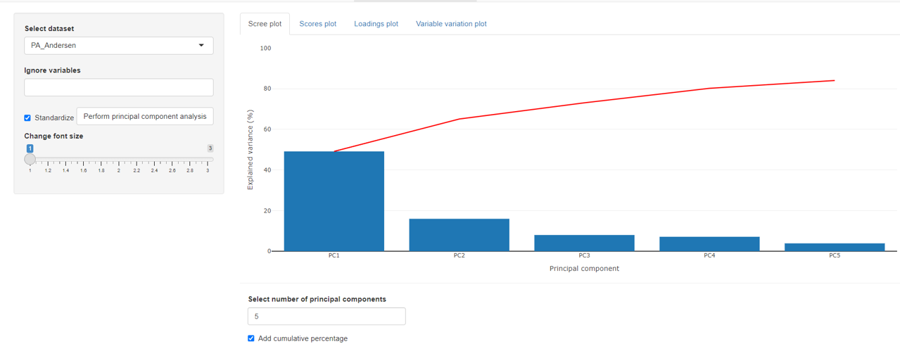
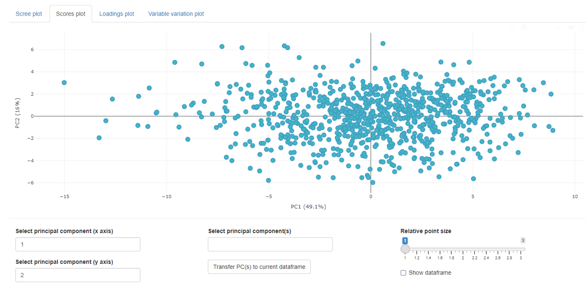
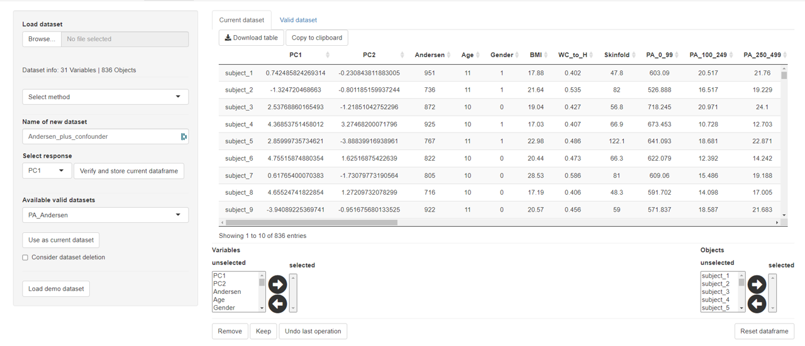
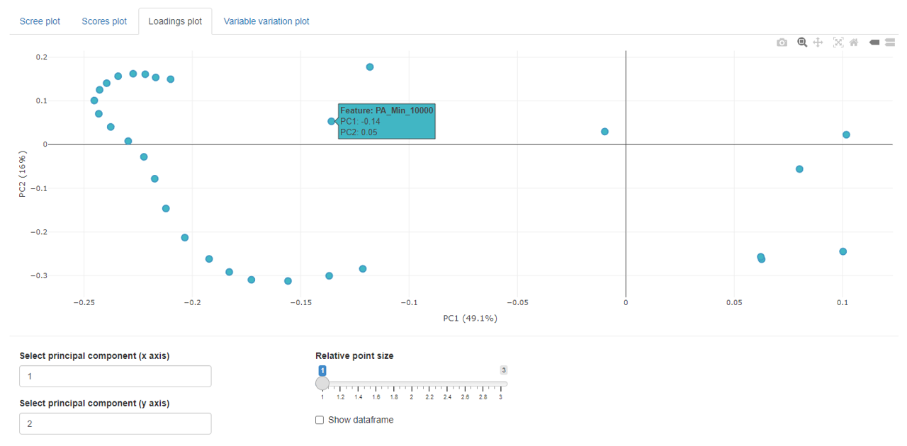
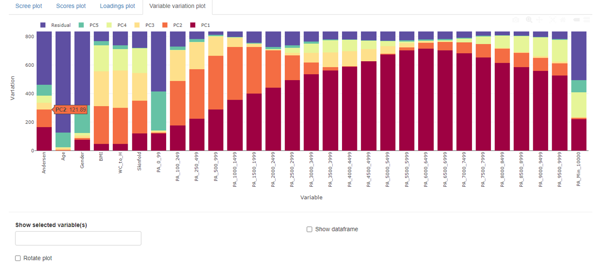

## Principal component analysis

Principal component analysis (PCA) in *mvpaShiny* is performed by the `prcomp()` function of the in-built R **stats** package. Besides the typical reportings of scree, scores and loading plots, *mvpaShiny* offers a variable variation plot that visualizes each variables contribution to all respective principal components. One objective of PCA inside of *mvpaShiny* is to act as a dimension reduction tool, so that extracted principal components (PCs) can be used to substitute a set of (collinear) variables. 

If the dataset has not been standardized before, standardization can still be performed before the PCA, using the **Standardize** checkbox. 

### Scree plot

The scree plots indicates the explained variance for each principal component. An additional cumulative percentage  line can be added.

### Scores plot

The score plots shows all individual sample's scores in a 2D point plot.  

#### Transferring scores to **current dataset**

As mentioned in the introduction to the PCA, scores can be used as latent variables for further analysis. In order to use the scores, the desired PC scores need to be selected before they are sent to the **current dataset** tab. This means that the user should have a current dataset prepared to which the PCs shall be added. An example is shown below. 

> It is important to remember that only scores can be added to datasets that match the number of objects and also match the object names.

### Loadings plot

The loadings plots shows the loading value for each variable in a 2D point plot.  

### Variable variation plot

The variable variation plot shows each variable's contribution to the individual principal component. For illustrative purposes, all principal components above 5 are comprised in a residual bar. However, the accompanying table contains all individual contributions.
