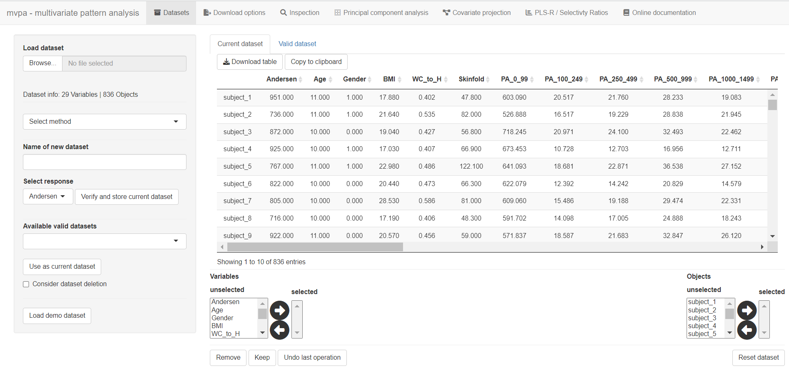

## Introduction

The core objective of the *mvpaShiny* is to identify latent structures and important variables in multivariate datasets, containing multiple supposedly explanatory variables (**X**) and response (**y**). *mvpaShiny* uses the functions embedded in the *mvpa* R package (**m**ulti**v**ariate **p**attern **a**nalysis) bundled in an R shiny web app. This shall facilitate dataset handling and the downstream data analysis by offering a simple-to-use graphical user interface. *mvpaShiny* offers various methods to unravel the datasets, namely using principal component analysis (PCA), confounder projection and projection to latent structures (alias partial least squares, PLS) regression.

## Objectives tackled by *mvpaShiny*

- Dataset preparation and inspection &rarr; Creation of subsets, scaling/transformation and initial inspection (correlation / variable normality)
- Reduction of dimensions / Handle collinearity &rarr; Substitute redundant variables by a new latent variable that combines multiple similar variables
- Adjust for covariate variables and alleviate their influence
- Create validated partial least squares (PLS) regression models and identify important variables &rarr; Build a formula of the given explanatory variables (**X**) that predicts and explains the response (**y**) as good as possible
- Visualization of association patterns to enhance model interpretation
- Integrate the above mentioned methods in a simple manner to handle complex datasets

## Requirements

*mvpaShiny* can be used online using the following link [*mvpaShiny* - web version](http://www.mvpashiny.org)

However, *mvpaShiny* can also be operated locally through R Studio. 

An installation guide for the local version is offered here:  [How to install *mvpaShiny*]({{'/Installation' | relative_url}})

